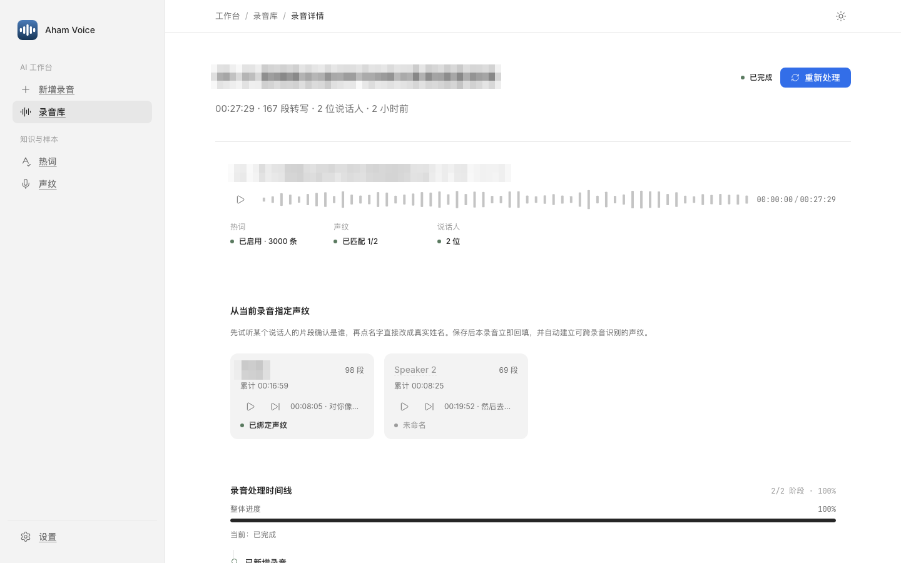
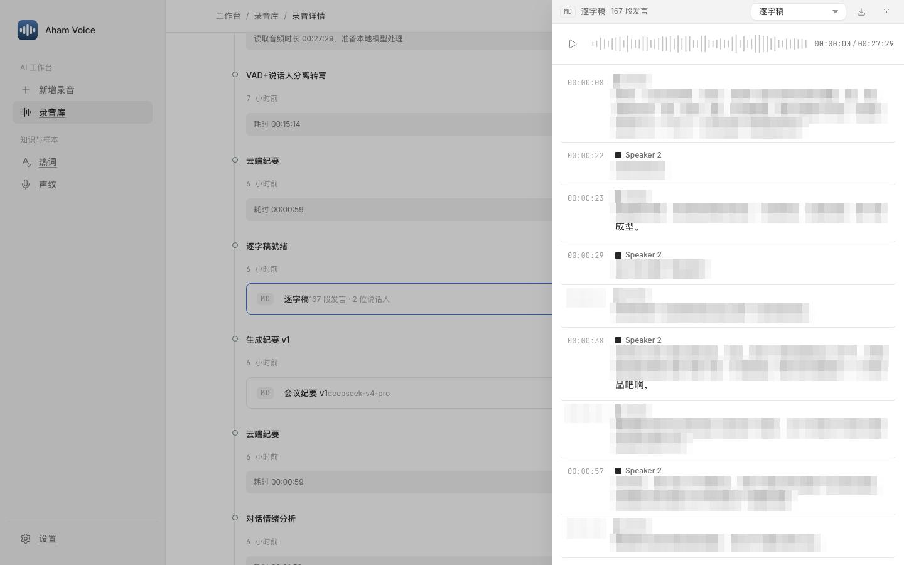
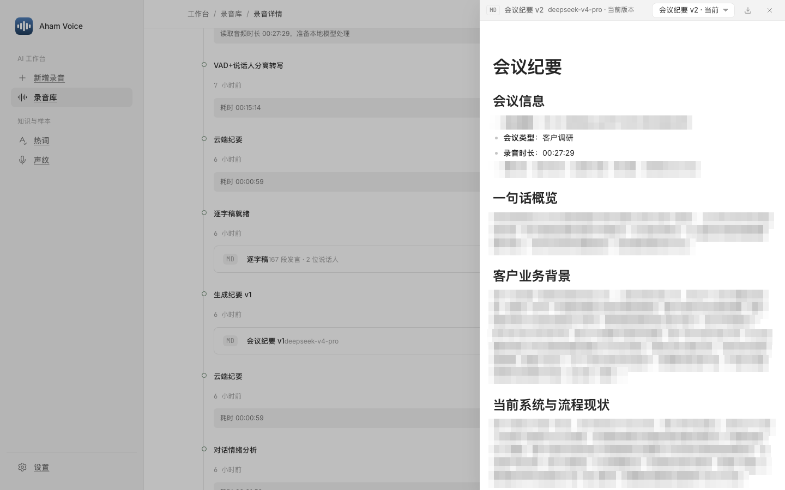
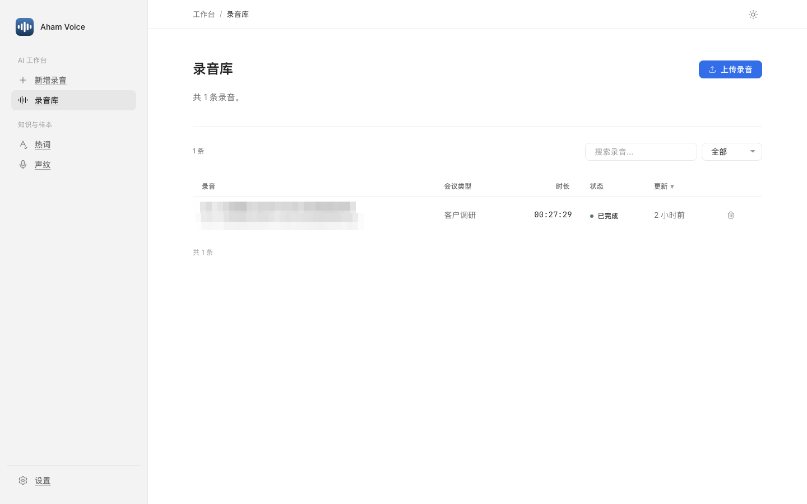

# Aham Voice — 录音转写与会议纪要（macOS）

[](https://github.com/li599198347-svg/aham-voice/releases)
[](LICENSE)
[](https://github.com/li599198347-svg/aham-ui)
[](#)
[](assets/wechat-qr.png)


## 为什么做

录音转写工具不少，但多是网页服务：音频要上传到别人的服务器，转写完往往只给一段没分说话人、没结构的纯文本，纪要还得自己再整理。本地能离线跑的，又通常停在「出一段字」。

Aham Voice 为此而做：把整条链路在一台 Mac 上接完整——转写、说话人分离、声学情绪全部本地离线，只有最后成稿的纪要才交给你自己的大模型，音频和数据不离开本机。

## 定位

- **本地优先** — 转写（FunASR）、说话人分离（CAM++）、声学情绪（emotion2vec）全部本地离线，音频不上传。
- **自行配置 LLM Key** — 纪要与情绪语义走云端大模型，用你自己的 OpenAI 兼容接口，Key 仅存本机。
- **单机克制** — 无登录、无多用户、无外部集成；一个自包含的 macOS 应用，装上就能用。
- **一体成稿** — 从录音到分说话人的逐句稿，再到结构化纪要，一条流水线走完。

> 简言之：把「录音 → 纪要」做利落的单机 Mac 应用，隐私留本机，成稿交给你信任的模型。

## 能做什么

- **本地转写** — FunASR paraformer + VAD + 标点，离线出逐句稿。
- **说话人分离** — CAM++ 声纹，逐句标注谁在说；声纹可管理。
- **声学情绪** — emotion2vec 本地情绪标注。
- **AI 会议纪要** — 云端大模型成稿，可按自然语言重写；附情绪语义分析。
- **热词** — 「热词」页手动增删，或「导入 txt」批量导入。
- **单机** — 无登录、无多用户、无外部集成，配置只存本机。

## 预览

<table>
<tr>
<td width="50%"></td>
<td width="50%"></td>
</tr>
<tr>
<td align="center"><sub>录音详情 · 波形播放器 · 说话人卡</sub></td>
<td align="center"><sub>逐句转写 · 用形状区分说话人</sub></td>
</tr>
<tr>
<td></td>
<td></td>
</tr>
<tr>
<td align="center"><sub>AI 会议纪要</sub></td>
<td align="center"><sub>录音库</sub></td>
</tr>
</table>

## 开始使用

到 [Releases](https://github.com/li599198347-svg/aham-voice/releases/latest) 下载（仅 Apple Silicon）。DMG 内置模型、体积大，按 GitHub 单文件上限分卷上传，下载全部分卷后在同一目录合并：

```bash
cat AhamVoice-*.dmg.* > "Aham Voice.dmg"
```

拖 Aham Voice 到「应用程序」→ 首次运行 `xattr -dr com.apple.quarantine /Applications/AhamVoice.app` 解除隔离 → 在「设置」填 OpenAI 兼容 API Key 即可。从源码构建 / 打包流程见 [DEPLOY.md](DEPLOY.md)。

---

## 更新记录

[Releases](https://github.com/li599198347-svg/aham-voice/releases) · [CHANGELOG](CHANGELOG.md)（Keep a Changelog · SemVer） · [CONTRIBUTING](CONTRIBUTING.md) · [MIT](LICENSE)

## 关于 Aham

> 把灵光一现，做成能用的 AI 工具。Aham 来自 *aha moment*，每个工具只把一件事做利落。

| 应用 | 一句话 |
|---|---|
| [Aham UI](https://github.com/li599198347-svg/aham-ui) | 供 AI 消费的设计系统——写一次规范，AI 产出处处一致 |
| [Aham Word](https://github.com/li599198347-svg/aham-word) | 供 AI 消费的 Word 规范——AI 据规范产出处处一致的 .docx |
| [Aham Survey](https://github.com/li599198347-svg/aham-survey) | 现场调研工具（macOS）——本地优先，把现场对话做成结构化调研成果 |
| **Aham Voice** | 录音转写与会议纪要（macOS）——本地离线转写，纪要走你自己的模型 |
| [Aham PPT](https://github.com/li599198347-svg/aham-ppt) | 克制的 AI PPT 制作技能——把素材做成方案级 PPT |

### 关注 · 交流

公众号看更多 AI 工具实践与更新；也欢迎扫码加我，交流与反馈。

<p></p>
