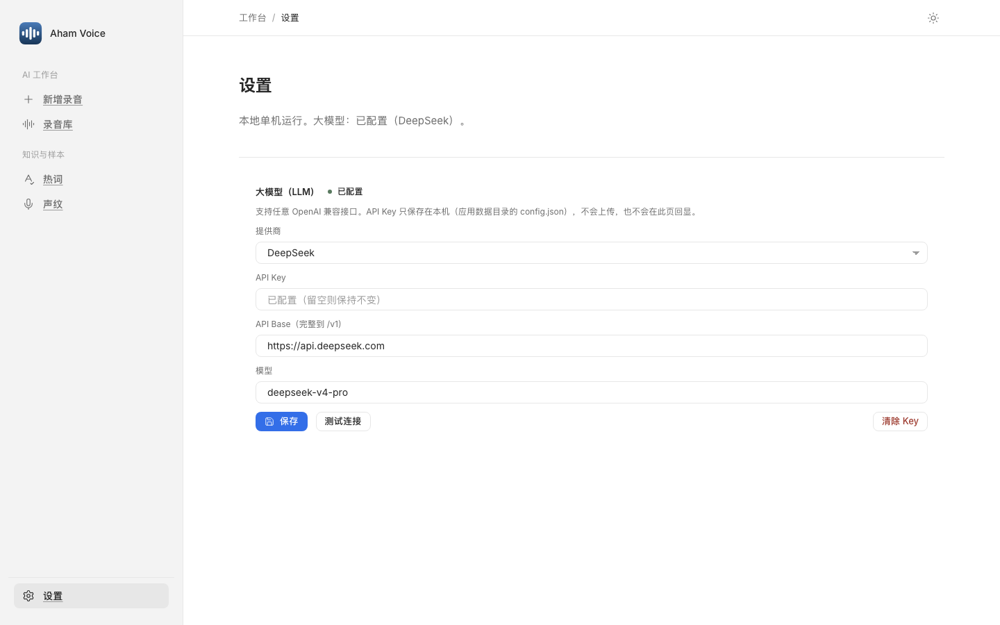
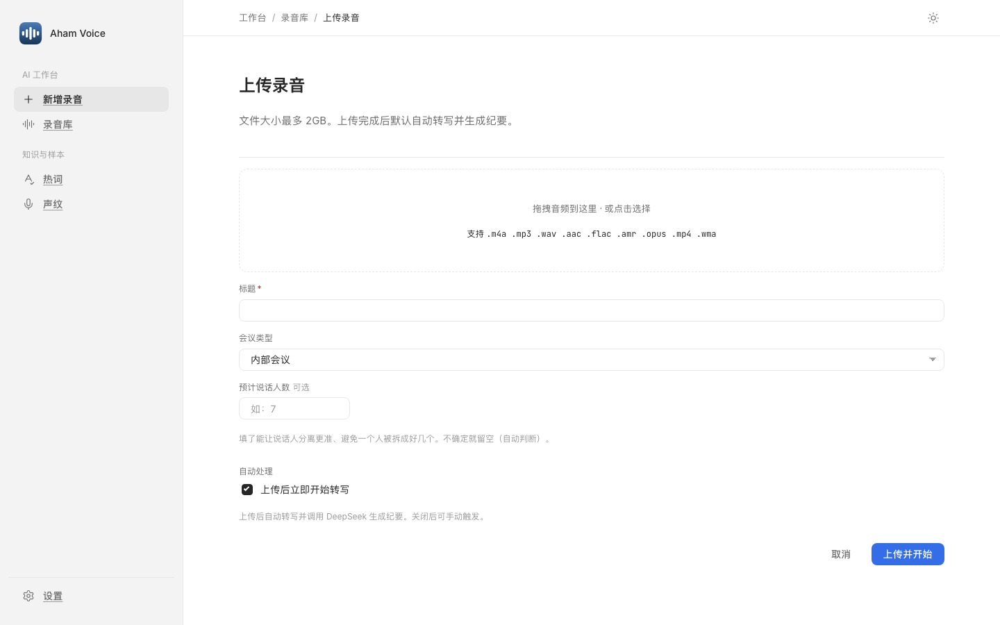

# Aham Voice — 录音转写与会议纪要（macOS）

[](https://github.com/li599198347-svg/aham-voice/releases)
[](LICENSE)
[](https://github.com/li599198347-svg/aham-ui)
[](#)


> **Aham 应用矩阵**：[Aham UI](https://github.com/li599198347-svg/aham-ui) · [Aham Survey](https://github.com/li599198347-svg/aham-survey) · **Aham Voice** · [Aham PPT](https://github.com/li599198347-svg/aham-ppt)

一个**单机 macOS 桌面应用**，开箱即用——本地优先、自带 Key：

- 录音 → 转写（FunASR paraformer + VAD + 标点）→ 说话人分离（CAM++）→ 声学情绪（emotion2vec），**全部本地离线**。
- 会议纪要 + 情绪语义分析走**云端大模型**（OpenAI 兼容接口，比如 DeepSeek 等；在「设置」页填自己的 API Key，仅存本机，不回显明文）。
- 无登录、无多用户、无外部集成；热词在「热词」页手动增删，或用「**导入 txt**」批量导入。

## 预览

<table>
  <tr>
    <td width="50%"></td>
    <td width="50%"></td>
  </tr>
  <tr>
    <td align="center">录音详情 · 波形播放器 · 说话人卡</td>
    <td align="center">逐句转写 · 用形状区分说话人</td>
  </tr>
  <tr>
    <td></td>
    <td></td>
  </tr>
  <tr>
    <td align="center">AI 会议纪要</td>
    <td align="center">录音库</td>
  </tr>
  <tr>
    <td></td>
    <td></td>
  </tr>
  <tr>
    <td align="center">设置 · 任意 OpenAI 兼容接口</td>
    <td align="center">新增录音</td>
  </tr>
</table>

## 下载

到 [Releases](https://github.com/li599198347-svg/aham-voice/releases/latest) 下载最新版（**仅 Apple Silicon**）。DMG 内置全部模型、体积较大，按 GitHub 单文件上限**分卷上传**——下载全部分卷后在同一目录合并：

```bash
cat AhamVoice-v2.0.0.dmg.* > "Aham Voice.dmg"
```

双击 DMG → 拖 **Aham Voice** 到「应用程序」→ 首次运行解除隔离（见下文「打包」）→ 在「设置」页填 OpenAI 兼容 API Key 即可开箱使用。

也可按 [DEPLOY.md](DEPLOY.md) 从源码构建运行。

## 架构

```
app_launcher.py              # 桌面入口：起 uvicorn + pywebview 原生窗口
backend/app/main.py          # FastAPI 单进程（单文件），同时提供 /api 与前端 dist
frontend-src/                # 前端源码（React + Vite + TS + Tailwind v4 + Aham 设计系统）
frontend/dist/               # 前端构建产物（被跟踪；单进程挂载 + SPA fallback）
packaging/macos/build_app.sh # 打包成自包含 .app + DMG
```

数据目录默认 `~/Library/Application Support/AhamVoice`（可用 `RECORDING_AI_HOME` 覆盖）；
大模型配置存 `数据目录/config.json`。模型/ffmpeg 在打包时内置进 `.app`。

> **在另一台 Mac 从源码部署**（装模型/依赖/ffmpeg、跑起来、打包）见 [DEPLOY.md](DEPLOY.md)。

## 本机开发（单进程）

```bash
cd frontend-src && npm install && npm run build    # 产出 ../frontend/dist
cd .. && <venv-python> -m uvicorn backend.app.main:app --port 8765
# 浏览器打开 http://127.0.0.1:8765    （端口别用 5173/5174）
```

改了 `frontend-src` 必须重新 `npm run build`（`frontend/dist` 是被跟踪的）。
后端语法自检：`<venv-python> -m py_compile backend/app/main.py`。

## 打包（出 .app + DMG）

```bash
bash packaging/macos/build_app.sh        # 约十几分钟，输出 ~/AhamVoice-build/
```

内置 CPython(arm64) + 全部依赖 + 5 个模型 + 静态化 ffmpeg，ad-hoc 签名。**仅 Apple Silicon**。
装到别的 Mac 后首次运行需解除隔离：

```bash
xattr -dr com.apple.quarantine /Applications/AhamVoice.app
```

（或右键 → 打开 → 再点「打开」。）

## 热词 txt 导入格式

每行一个热词，空行忽略。每个词只能是**中文 / 字母 / 数字**（不含空格或标点符号）。导入后自动去重（不区分大小写）、按拼音排序，点「保存」生效。

```
CRM
金蝶接口
会议纪要
```

在「热词」页点「导入 txt」选文件即可；也可直接在富文本框里用顿号「、」分隔手动维护。

## 主要 API

| 路由 | 用途 |
|---|---|
| `GET /api/me` | 当前（固定本机）用户 |
| `GET/PATCH /api/settings` | 大模型 API Key / 模型 |
| `GET/POST /api/recordings` | 录音列表 / 上传 |
| `GET /api/recordings/{id}` | 录音详情（逐字稿/纪要/说话人/情绪） |
| `POST /api/recordings/{id}/summarize` | 大模型生成纪要 |
| `POST /api/recordings/{id}/summary/revise` | 按自然语言重写纪要 |
| `POST /api/recordings/{id}/emotion` | 情绪语义分析 |
| `GET/POST/PATCH/DELETE /api/hotwords` | 热词增删改查 |
| `POST /api/hotwords/import` | 从 txt 批量导入热词 |
| `GET/POST/PATCH /api/voiceprints` | 声纹管理 |

完整路由见 `backend/app/main.py` 里的 `@app.` 装饰器。

## 版本与许可

- 版本与下载：[Releases](https://github.com/li599198347-svg/aham-voice/releases)
- 变更记录：[CHANGELOG.md](CHANGELOG.md)（Keep a Changelog · SemVer）
- 参与贡献：[CONTRIBUTING.md](CONTRIBUTING.md)
- 许可：[MIT](LICENSE)

---

## 关于 Aham

> **把灵光一现，做成能用的 AI 工具。**

Aham 来自 *aha moment*。每个工具只把一件事做利落。

| 应用 | 一句话 |
|---|---|
| [Aham UI](https://github.com/li599198347-svg/aham-ui) | 供 AI 消费的设计系统——写一次规范，AI 产出处处一致 |
| [Aham Survey](https://github.com/li599198347-svg/aham-survey) | 现场调研工具（macOS）——聊一圈，调研结果自己长出来 |
| [Aham Voice](https://github.com/li599198347-svg/aham-voice) | 录音转写与会议纪要（macOS）——录一段会，纪要已经写好 |
| [Aham PPT](https://github.com/li599198347-svg/aham-ppt) | 咨询级 AI PPT 制作技能——丢一堆素材，幻灯片出来了 |
